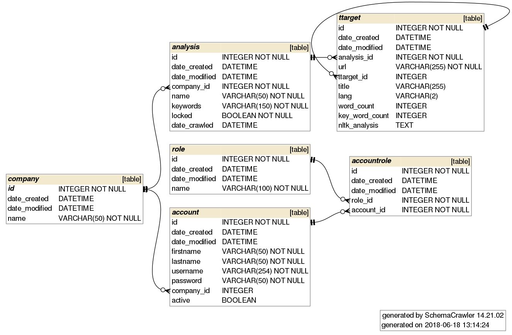

# Aineopintojen harjoitustyö: tietokantasovellus, kesä 2018

Linkki Herokussa pyörivään sovellukseen: https://shielded-brook-33904.herokuapp.com/

Käyttäjätunnukset: 
* Sähköposti: paivio@tsoha18, salasana: salainen (pääylläpitäjä)
* Sähköposti: yngve@tsoha18, salasana: salainen (ylläpitäjä)
* Sähköposti: aukusti@asianajotoimisto, salasana: salainen (asiakas)
* Sähköposti: akuliina@asianajotoimisto, salasana: salainen (asiakas)
* Sähköposti: ida@ideahautomo, salasana: salainen (asiakas)

## Aihe

Julkisuusseuranta valitun avainsanan / avainsanojen ympäriltä

Aiheen motivaationa on NLTK:n ominaisuuksiin tutustuminen ja mielekäs hyödyntäminen tietokantaprojektissa sekä mahdollisesti data-analyysin graafisiin työkaluihin tutustuminen. 

## Käyttötapaukset / käyttäjätarinat
Käyttäjätarinat on listattu erillisessä dokumentissa: <a href="/documentation/userstories.md">Käyttäjätarinat</a>

## Tieto-olioita (pohdintaa)
* Asiakas (customer)
    * customer_id, name
* Asia (subject)
    * subject_id, title, keywords
* Seurattavat kohteet (target)
    * target_id, title, type, uri
* Asian seurattavat kohteet (subject_target)
    * subject_id, target_id
* Työ (job)
    * subject, status, start_time, finnish_time, analysis_id
* Analysis
    * analysis_id
    
## Tietokantakaavio

    
## Featureja, kirjastoja
* Python boilerpipe: [Boilerplate Detection Using Shallow Text Feature](http://www.l3s.de/~kohlschuetter/publications/wsdm187-kohlschuetter.pdf)
* Python jusText library: [https://nlp.fi.muni.cz, jusText demo](https://nlp.fi.muni.cz/projects/justext/?url=https%3A%2F%2Ffi.wikipedia.org%2Fwiki%2FKurt_G%25C3%25B6del&language=Finnish&max_heading_distance=150&max_good_distance=5&length_low=70&length_high=140&stopwords_low=0.2&stopwords_high=0.3&max_link_density=0.4)
    * The demo seems to be working even though my project has some issues
* [O'Reilly Guide to text mining](https://www.oreilly.com/library/view/mining-the-social/9781449368180/ch05.html) 

## Ulkoasu
* Harjoitustyössä on käytetty [SB Bootstrap](https://startbootstrap.com/template-overviews/sb-admin/) ulkoasumallia
